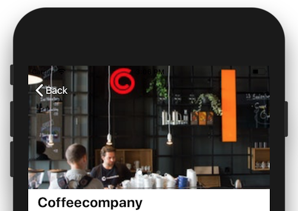

# Proces App Studio

## Vrijdag 12 -01
De eerste stap in het opzetten van het xcode project was een begin maken aan het storyboard in UI builder. Op het beginscherm heb ik gekozen om d drie cellen waarin info over de koffiezaakjes komt te staan op de zetten als knoppen. Een tableview inbouwen met daarin cellen die ver genoeg uit elkaar stonden bleek lastiger dan het leek en ook op Stack Overflow kon ik weinig informatie vinden. 

## Maandag 15 - 01
Vandaag wilde ik graag stappen maken in het opvragen en laten zien van details over een coffee bar in de detailViewController.

Het gebruiken van de JSON levert soms wat problemen op m.b.t. optionals. Ik moet er even achter gaan komen hoe dit precies in elkaar steekt. Dat is een goede taak voor morgen. 

API functies worden nu aangeroepen in ViewDidLoad().

Als laatste ben ik bezig geweest met het aanpassen van de kleur van de tekst van de status bar. De code die ik overal vind is:
	override var preferredStatusBarStyle : UIStatusBarStyle {
	return UIStatusBarStyle.default
	}
Ik heb een test App’je van GitHub gehaald en hier werd deze code, maar in mijn eigen project niet… Marijn kon er ook niet achter komen.

## Dinsdag 16 - 01
Toegevoegde functies:
- Afstand huidige locatie naar venue is zichtbaar in home en detail view.
- Vanuit detail view kan kaart worden opgeroepen met de huidige locatie en locatie van geselecteerde venue. 

Naast het implementeren van deze functies heb ik nog even gekeken naar de manier waarop de JSONs worden uigepakt. Ik heb er voor gezorgd dat optionals niet meer geforceerd worden uitgepakt om crashes te voorkomen. 
