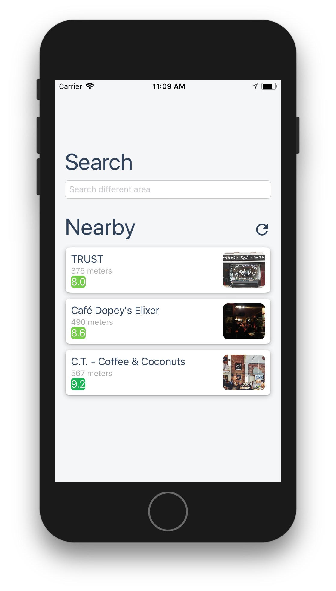
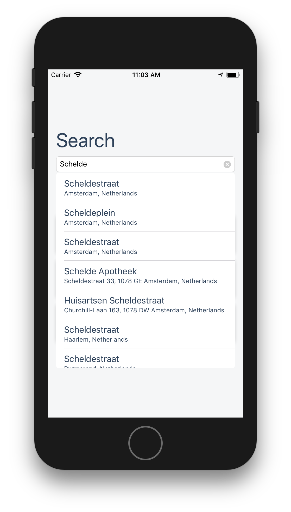
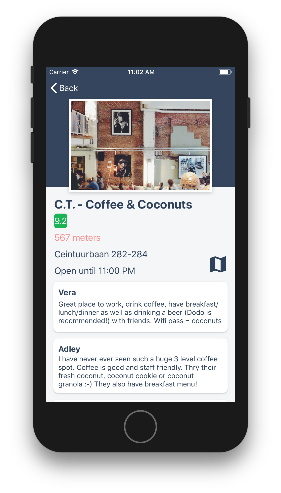
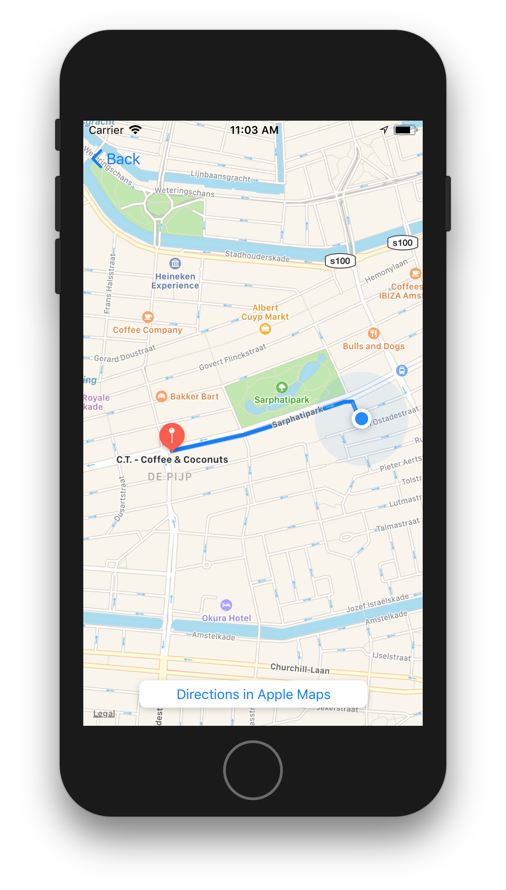

# Spro (espresso)
Door Sam Kortekaas.

## Beschrijving

Deze app laat op een overzichtelijke manier de beste drie (specialty) koffiezaakjes op loopafstand van je huidige locatie zien, zodat je makkelijk een keuze kunt maken. 

## Gebruik
Om de app te gebruiken moet je er voor zorgen dat je een actieve internetverbinding hebt en locatievoorzieningen ingeschakeld zijn.

## Version 
Version 1.0

## Works on
Apparaten met IOS 11 of hoger. iPad wordt niet ondersteunt. 

## Credits
#### JSON extractie hulpmiddel SwiftyJSON:
- https://github.com/SwiftyJSON/SwiftyJSON
#### Tabel updaten als nieuwe automatische suggesties beschikbaar zijn: 
- https://stackoverflow.com/questions/41136150/swift-mapkit-autocomplete#41150928
#### Huidige locatie van de gebruiker op de kaar laten zien en de kaar schalen:
- https://www.raywenderlich.com/160517/mapkit-tutorial-getting-started
#### Een route aanvragen en laten zien met MKDirections:
- https://www.ioscreator.com/tutorials/draw-route-mapkit-tutorial
#### Alle data, afbeeldingen en reviews die gebonden zijn aan koffiezaken zijn afkomstig van Foursquare:
- https://developer.foursquare.com/docs/terms-of-use/overview

## Contact

Sam Kortekaas
Mail: samkortekaas1@gmail.com

## Screenshots

